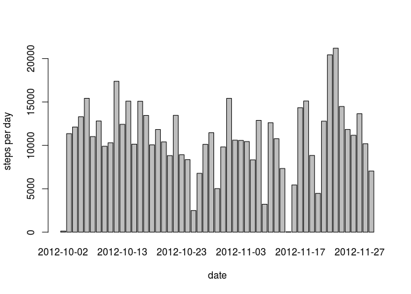
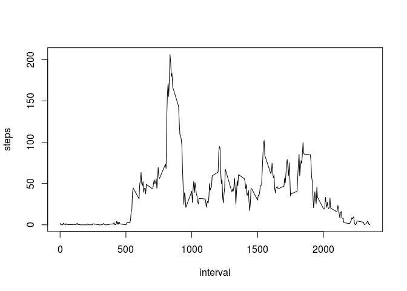
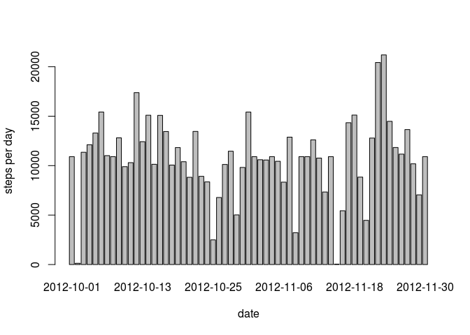
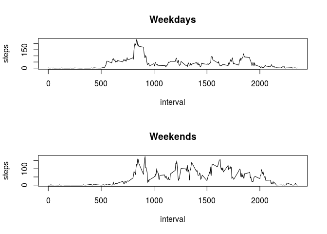

# Reproducible Research: Peer Assessment 1


## Loading and preprocessing the data


```r
data <- read.csv('activity.csv')
```

## What is mean total number of steps taken per day?
##### Histogram of the total number of steps taken each day

```r
stepseachday <- aggregate(steps ~ date, data, FUN=sum)
barplot(stepseachday$steps, names.arg=stepseachday$date, xlab="date", ylab="steps per day")
```

 

##### Calculate and report the mean and median total number of steps taken per day

```r
mean(stepseachday$steps)
```

```
## [1] 10766.19
```

```r
median(stepseachday$steps)
```

```
## [1] 10765
```

## What is the average daily activity pattern?

##### Time Series Plot

```r
stepseachinterval <- aggregate(steps ~ interval, data, FUN=mean)
plot(stepseachinterval, type="l" )
```

 

##### max steps in which interval

```r
stepseachinterval$interval[which.max(stepseachinterval$steps )]
```

```
## [1] 835
```

## Imputing missing values

##### total number of missing values

```r
sum(is.na(data))
```

```
## [1] 2304
```
##### strategy for filling in all of the missing values in the dataset.
We can use averages of remaining days' 5-minute intervals to replace missing values

##### New dataset


```r
stepValues <- data.frame(data$steps)  
stepValues[is.na(stepValues),] <- ceiling(tapply(X=data$steps,INDEX=data$interval,FUN=mean,na.rm=TRUE))
newData <- cbind(stepValues, data[,2:3])
colnames(newData) <- c("steps", "date", "interval")
```

##### Histogram for New dataset

```r
stepseachday <- aggregate(steps ~ date, newData, FUN=sum)
barplot(stepseachday$steps, names.arg=stepseachday$date, xlab="date", ylab="steps per day")
```

 

##### mean and median for new dataset

```r
mean(stepseachday$steps)
```

```
## [1] 10784.92
```

```r
median(stepseachday$steps)
```

```
## [1] 10909
```

Although there isnt much difference in the mean and median of new vs old data, there is a slight increase in them after replacing NAs.

## Are there differences in activity patterns between weekdays and weekends?

##### Weekday/Weekend Column


```r
daytype <- function(date) {
    if (weekdays(as.Date(date)) %in% c("Saturday", "Sunday")) {
        "weekend"
    } else {
        "weekday"
    }
}
data$daytype <- as.factor(sapply(data$date, daytype))
```

##### Panel Plots


```r
par(mfrow=c(2,1))
weekdaystepseachinterval <- aggregate(steps ~ interval, data, subset=data$daytype=="weekday", FUN=mean)
plot(weekdaystepseachinterval, type="l", main ="Weekdays" )
weekendstepseachinterval <- aggregate(steps ~ interval, data, subset=data$daytype=="weekend", FUN=mean)
plot(weekendstepseachinterval, type="l", main ="Weekends" )
```

 
